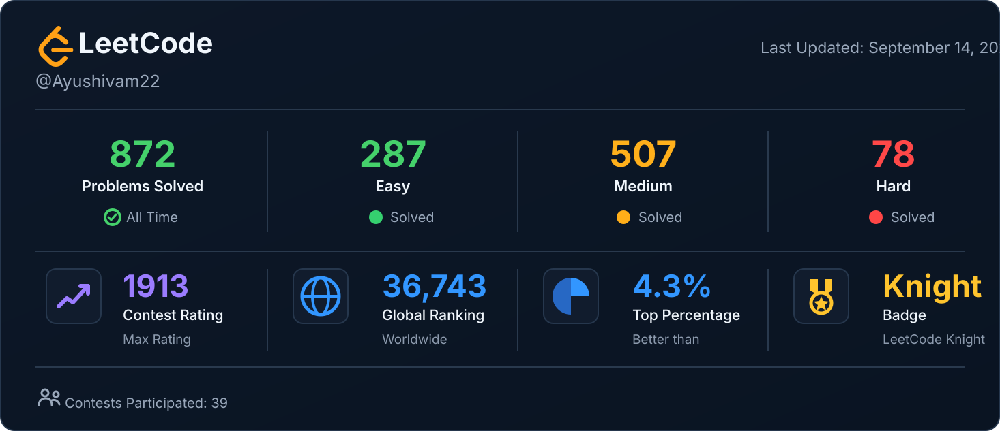

<div align="center">

# Hey, I'm Ayush Shivam 👋

### Full-Stack Developer · Problem Solver · Computer Science Student

<p>
  <a href="https://github.com/ayushivam22">
    
  </a>
  <a href="https://github.com/ayushivam22">
    
  </a>
</p>

</div>

---

<div align="center">


</div>

---

## 👨‍💻 About Me

I'm a Computer Science undergraduate at **IIIT Bhagalpur** who enjoys building systems, solving problems, and understanding how things work under the hood.

- 🎓 B.Tech in Computer Science & Engineering
- 💻 Full-stack development
- ⚙️ Backend systems & APIs
- 🧠 Data Structures & Algorithms
- 🐳 Docker & deployment
- ☁️ AWS & cloud infrastructure
- 🚀 Currently exploring **Go, system design, and backend engineering**

---

## 🛠️ Tech Stack

### Languages

<p>
  
</p>

### Frontend

<p>
  
</p>

### Backend & Databases

<p>
  
</p>

### DevOps & Tools

<p>
  
</p>

---

## 🧠 Problem Solving

I regularly practice Data Structures & Algorithms and competitive programming.

<div align="center">

<!--
    Keep this section connected to your existing
    LeetCode-generation script.

    Do NOT hardcode your problem count here.
-->



</div>

---

## 🚀 Featured Projects

### 💬 Real-Time Chat Application

A real-time messaging application built with a Next.js frontend and a WebSocket backend.

**Highlights**

- Real-time communication using WebSockets
- Authentication with NextAuth
- MongoDB for persistent data
- In-memory Maps for active-user/session tracking
- WebSocket server deployed on AWS EC2
- Nginx reverse proxy
- PM2 process management
- SSL/TLS with Certbot

**Stack:** `Next.js` `TypeScript` `MongoDB` `WebSocket` `AWS EC2` `Nginx` `PM2`

---

### ⚖️ Online Judge

A LeetCode-style online judge designed around isolated code execution.

**Highlights**

- Multi-language execution architecture
- Docker-based sandboxing
- Separate API and Judge servers
- Redis-based submission queue
- Scheduler and worker architecture
- Compilation and execution isolation
- Automated output evaluation
- Resource limits for submitted programs

**Stack:** `TypeScript` `Node.js` `Docker` `Redis` `C++` `Python` `Java`

---

### 📋 Contractor Management Platform

A full-stack platform for managing contractors, contracts, applications, and project workflows.

**Highlights**

- Authentication
- Contractor registration
- Contract management
- Contractor bidding/application flow
- Supervisor management
- Status tracking

**Stack:** `Next.js` `TypeScript` `Tailwind CSS` `Supabase`

---

### ✅ Task Manager

A full-stack task management application with authentication and protected APIs.

**Highlights**

- JWT authentication
- CRUD operations
- Protected routes
- REST API
- MongoDB persistence

**Stack:** `React` `Node.js` `Express` `MongoDB`

---

## 📊 GitHub Activity

<div align="center">


<br/>


</div>

---

## 🧩 What I'm Working On

```text
┌──────────────────────────────────────────────────┐
│                                                  │
│  ▸ Backend Engineering                           │
│  ▸ Go                                            │
│  ▸ Distributed Systems                           │
│  ▸ Docker & Container Isolation                  │
│  ▸ System Design                                 │
│  ▸ Data Structures & Algorithms                  │
│  ▸ Building practical developer tools            │
│                                                  │
└──────────────────────────────────────────────────┘
```

---

## 📈 Current Focus

```text
DSA                ████████████████████  Strong
Full Stack         ███████████████████░  Strong
Backend             █████████████████░░░  Growing
Cloud / DevOps      ███████████████░░░░░  Growing
System Design       ████████████░░░░░░░░  Learning
Go                  ██████████░░░░░░░░░░  Learning
```

---

## 🌐 Connect With Me

<div align="center">

<a href="https://github.com/ayushivam22">
  
</a>

<a href="https://www.linkedin.com/in/ayushivam22/">
  
</a>

</div>

---

<div align="center">

### "Build things. Break things. Understand why."

<br/>


</div>
